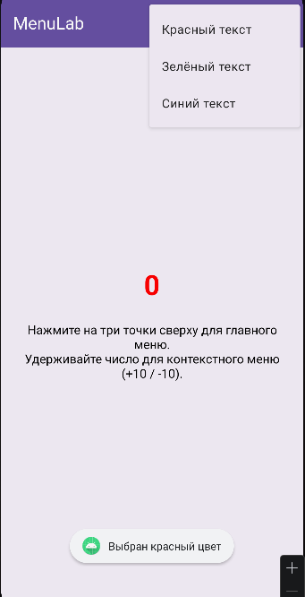
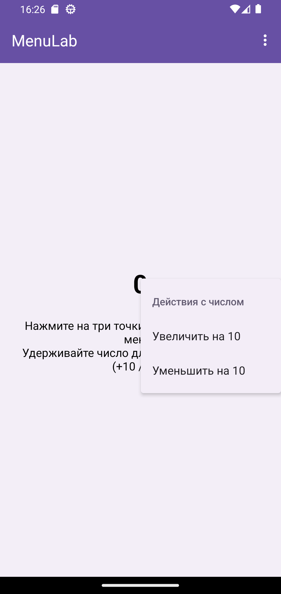
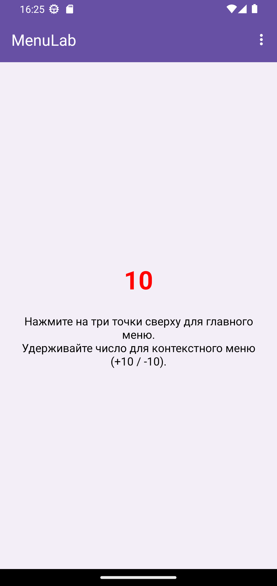

<div align="center">

# Отчет

</div>

<div align="center">

## Практическая работа №9

</div>

<div align="center">

## Создание меню

</div>

**Выполнил:**
Майстренко Константин Александрович
**Группа:** инс-б-о-24-2

---

### Цель работы

Изучить способы создания и обработки событий от различных типов меню в Android: главного меню (`OptionsMenu`) и контекстного меню (`ContextMenu`). Научиться динамически изменять интерфейс приложения с помощью пунктов меню.

### Ход работы

В ходе выполнения практической работы было создано Android-приложение, демонстрирующее использование двух типов меню: главного меню (`OptionsMenu`) и контекстного меню (`ContextMenu`).

Сначала был разработан интерфейс главного экрана приложения. На экране были размещены элементы, с которыми в дальнейшем выполнялось взаимодействие через пункты меню. В зависимости от выбранного варианта это могли быть `TextView`, `ImageView`, кнопки, контейнеры с динамически добавляемыми элементами или другие компоненты интерфейса.

После этого было создано главное меню приложения. Для этого в папке `res/menu` был создан XML-файл с описанием пунктов меню. Далее в `MainActivity` был переопределён метод `onCreateOptionsMenu()`, который использовался для подключения меню к активности. Обработка выбора пунктов была реализована в методе `onOptionsItemSelected()`. При выборе различных пунктов меню изменялись свойства элементов интерфейса, например цвет, размер, количество фигур или отображаемое изображение.

Затем было реализовано контекстное меню. Для этого нужный элемент интерфейса был зарегистрирован методом `registerForContextMenu()`. После этого был переопределён метод `onCreateContextMenu()`, в котором создавались пункты контекстного меню, а в методе `onContextItemSelected()` была реализована обработка нажатий на эти пункты. Контекстное меню вызывалось долгим нажатием на соответствующий элемент.

Таким образом, в приложении были объединены оба способа работы с меню: главное меню для глобальных действий и контекстное меню для действий, связанных с конкретным элементом интерфейса.

Ниже приведены скриншоты выполнения работы.

<div align="center">


*Рисунок 1. Главный экран приложения*

</div>

<div align="center">


*Рисунок 2. Работа главного меню OptionsMenu*

</div>

<div align="center">


*Рисунок 3. Работа контекстного меню ContextMenu*

</div>

<div align="center">


*Рисунок 4. Результат изменения интерфейса с помощью меню*

</div>

### Вывод

В результате выполнения практической работы были изучены основные типы меню в Android и способы их использования.
Я научился создавать `OptionsMenu` и `ContextMenu`, подключать их к активности, обрабатывать выбор пунктов меню и изменять интерфейс приложения в зависимости от действий пользователя.
Практическая работа помогла лучше понять, как реализуются дополнительные элементы управления в Android-приложениях и как с их помощью можно организовать взаимодействие с интерфейсом.

### Ответы на контрольные вопросы

1. **Какие типы меню существуют в Android? Опишите их назначение.**
   В Android существуют три основных типа меню:

   * `OptionsMenu` — главное меню приложения, обычно вызывается через три точки в `ActionBar` и используется для глобальных действий;
   * `ContextMenu` — контекстное меню, вызывается долгим нажатием на конкретный элемент и содержит действия, относящиеся именно к нему;
   * `PopupMenu` — всплывающее меню, привязанное к определённому `View`, обычно вызывается по нажатию на кнопку.
     В данной работе использовались `OptionsMenu` и `ContextMenu`.

2. **Как создать главное меню (OptionsMenu)? Какие методы необходимо переопределить в Activity?**
   Для создания главного меню нужно:

   * создать XML-файл меню в папке `res/menu`;
   * переопределить метод `onCreateOptionsMenu()`, чтобы загрузить меню;
   * переопределить метод `onOptionsItemSelected()`, чтобы обработать нажатие на пункты.

   Пример:

   ```java
   @Override
   public boolean onCreateOptionsMenu(Menu menu) {
       getMenuInflater().inflate(R.menu.main_menu, menu);
       return true;
   }
   ```

3. **Для чего используется атрибут app:showAsAction? Какие значения он может принимать?**
   Атрибут `app:showAsAction` определяет, будет ли пункт меню показываться прямо в `ActionBar` или только в выпадающем меню.
   Основные значения:

   * `ifRoom` — показывать, если есть место;
   * `never` — не показывать в панели, только в меню;
   * `always` — всегда показывать в панели действий.

4. **Как зарегистрировать View для контекстного меню? В каком методе это обычно делается?**
   Для регистрации элемента используется метод:

   ```java
   registerForContextMenu(view);
   ```

   Обычно это делается в методе `onCreate()` после `setContentView()`.

5. **В чём разница между методами onCreateContextMenu и onContextItemSelected?**
   `onCreateContextMenu()` вызывается в момент создания контекстного меню и используется для добавления его пунктов.
   `onContextItemSelected()` вызывается после выбора одного из пунктов и используется для выполнения нужного действия.

6. **Как создать контекстное меню динамически (программно), без использования XML-ресурса?**
   Для этого в методе `onCreateContextMenu()` пункты добавляются вручную через `menu.add()`:

   ```java
   menu.add(0, 1, 0, "Пункт 1");
   menu.add(0, 2, 1, "Пункт 2");
   menu.add(0, 3, 2, "Пункт 3");
   ```

7. **Что возвращают методы onOptionsItemSelected и onContextItemSelected? Что означает возврат true?**
   Оба метода возвращают значение типа `boolean`.
   Если вернуть `true`, это означает, что событие обработано и дальше передавать его не нужно.
   Если вернуть результат `super...`, обработка может быть передана дальше стандартному механизму Android.

8. **Как определить, для какого именно элемента было вызвано контекстное меню, если зарегистрировано несколько View?**
   Для этого можно использовать параметр `View v` в методе `onCreateContextMenu()` и проверять `v.getId()`.
   В некоторых случаях дополнительно используется `menuInfo`, особенно если контекстное меню вызывается для элементов списка.

### Список литературы

1. Phillips, B., Stewart, K., & Marsicano, K. *Android Programming: The Big Nerd Ranch Guide* (5th Edition). Big Nerd Ranch Guides, 2022.
2. Документация Android Developers. Руководство по созданию меню в Android.
3. Гриффитс Д., Гриффитс Д. *Head First. Программирование для Android*. Питер, 2021.
4. Соколова В. В. *Разработка мобильных приложений на платформе Android*. М.: Юрайт, 2021.
5. Мэрфи М. *Основы Android программирования на Java*. СПб.: БХВ-Петербург, 2019.
